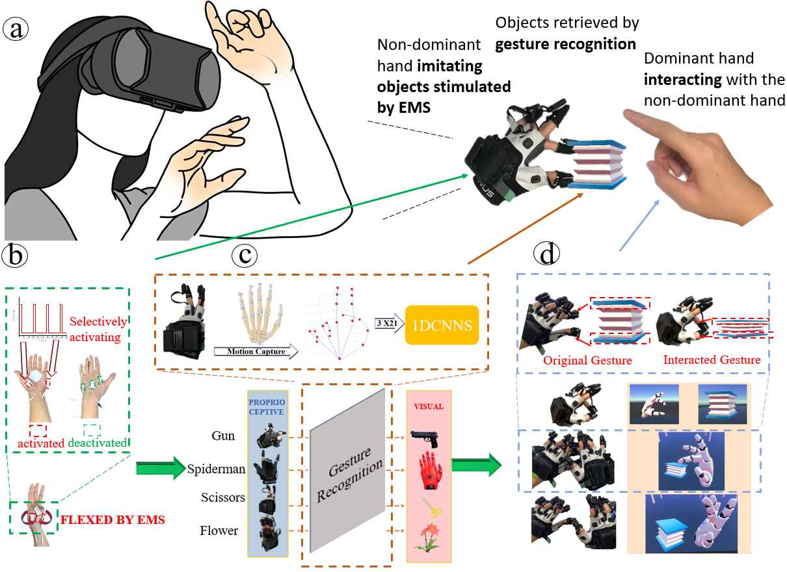
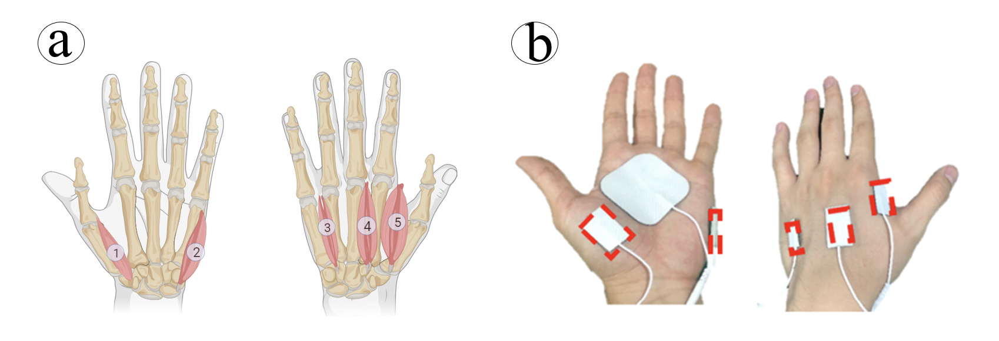

My Contributions :
1.  A **novel concept** of **leveraging the loss of SoA** caused by EMS to make the stimulated hand serve better as a virtual
object

2. Proposal of a highly reproducible **electrode layout** with a clear anatomical guide for actuating fingers via EMS and
inducing users to pose 8 gestures with it

3.  An interaction system that **combined EMS actuation, deep learning model, and data glove** to enable users to perform
**gestural object retrieval tasks** and be involved in **interactive scenarios** easily and immersively

This figure shows the electrode layout we provided, where each finger has an electrode attached to it, responsible for actuating that finger. This electrode layout is based on [*BackHandEMS*](https://dl.acm.org/doi/10.1145/3411764.3445761), which misses an explicit anatomical guide for electrode layout to stimulate interossei and lumbrical. Ours provides a highly reproducible electrode layout with a clear anatomical guide of the muscles for flexing each single finger. 

This figure shows 8 examples of actuating gestures via EMS and the virtual object corresponding to the gesture. Gestures design can be referred to [*HandInterfaces*](https://dl.acm.org/doi/10.1145/3491102.3501898).

This figure shows how to recognize these gestures using the data from data glove and simple neural network.

Here is a demo video of the system:

<video width="600" controls>
  <source src="/assets/Videos/ExampleVideos.mp4" type="video/mp4">
  Your browser does not support the video tag.
</video>

Unfortunately, our paper is rejected after rebuttal. Currently, we are preparing for next submission.